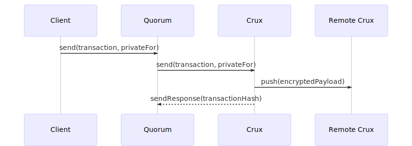
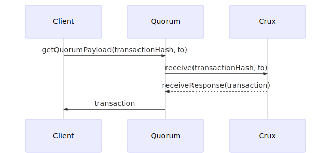

# Crux 

Data privacy for Quorum. 

Crux is a secure enclave for Quorum written in Golang. 

It is a replacement for [Constellation](https://github.com/jpmorganchase/constellation/), the 
secure enclave component of [Quorum](https://github.com/jpmorganchase/quorum/), written in Haskell. 

## Getting started

The best way to start is to run the Crux 
[7 Nodes Quorum example](https://github.com/blk-io/quorum-examples). This is a fork of the JP 
Morgan version.

If you you'd prefer to run just a client, you can build using the below instructions and run as per 
the below.

```bash
git clone https://github.com/blk-io/crux.git
cd crux
make setup && make
./bin/crux

Usage of ./bin/crux:
      crux.config              Optional config file
      --alwayssendto string    List of public keys for nodes to send all transactions too
      --berkeleydb             Use Berkeley DB for storage
      --generate-keys string   Generate a new keypair
      --othernodes string      "Boot nodes" to connect to to discover the network
      --port int               The local port to listen on (default -1)
      --privatekeys string     Private keys hosted by this node
      --publickeys string      Public keys hosted by this node
      --socket string          IPC socket to create for access to the Private API
      --storage string         Database storage file name (default "crux.db")
      --url string             The URL to advertise to other nodes (reachable by them)
      --verbosity int          Verbosity level of logs (default 1)
      --workdir string         The folder to put stuff in (default: .) (default ".")
``` 

## Generating keys

Each Crux instance requires at least one key-pair to be associated with it. The key-pair is used 
to ensure transaction privacy. Crux uses the [NaCl cryptography library](https://nacl.cr.yp.to/).

You use the `--generate-keys` argument to generate a new key-pair with Crux:

```bash
crux --generate-keys myKey
```

This will produce two files, named `myKey` and `myKey.pub` reflecting the private and public keys 
respectively.

## Core configuration

At a minimum, Crux requires the following configuration parameters. This tells the Crux instance 
what port it is running on and what ip address it should advertise to other peers.

Details of at least one key-pair must be provided for the Crux node to store requests on behalf of.  

```bash
crux --url=http://127.0.0.1:9001/ --port=9001 --workdir=crux --publickeys=tm.pub --privatekeys=tm.key --othernodes=https://127.0.0.1:9001/
```

## How does it work?

At present, Crux performs its cryptographic operations in a manner identical to Constellation. You 
can read the specifics [here](https://github.com/jpmorganchase/constellation/#how-it-works). 

The two main workflows for handling private transactions are as follows.

Submission of a new transaction:



Retrieval of an existing transaction:



## Why Crux?

*Crux is a constellation located in the southern sky in a bright portion of the Milky Way. It is 
among the most easily distinguished constellations, even though it is the smallest of all 88 
modern constellations. (Source: [Wikipedia](https://en.wikipedia.org/wiki/Crux))*

*The critical or transitional moment or issue, a turning point.*

## Thanks

[@patrickmn](https://github.com/patrickmn) the original author of Constellation. Crux would not 
exist were it not for his work.
